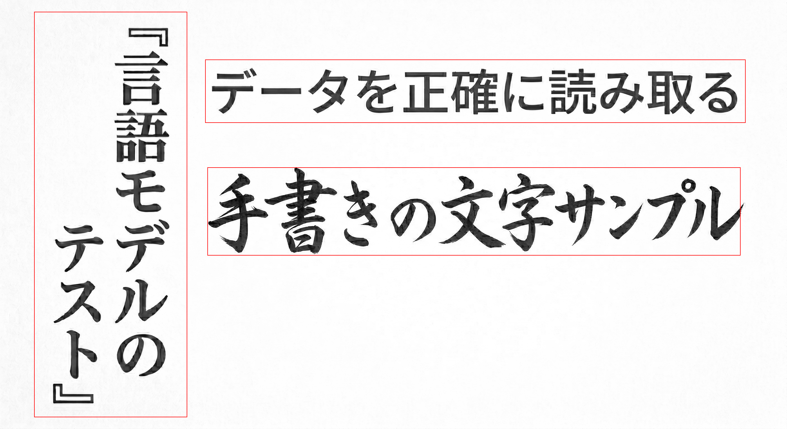
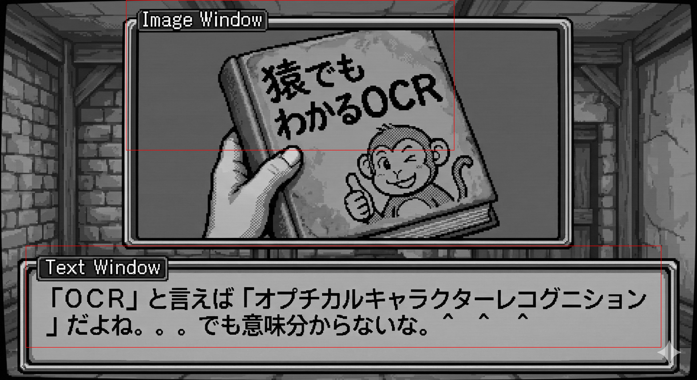

# examples

## detect_and_draw

Converts each input image to greyscale, runs the embedded DBNet model to locate
text regions, draws a 2-pixel red bounding box around each region, and writes
the results to `/dev/shm/jp_detect/`.

### Build

```sh
cargo build --example detect_and_draw --features onnx
```

### Run

**Default** — uses the two built-in test fixtures:

```sh
cargo run --example detect_and_draw --features onnx
```

**Custom images** — pass one or more paths as arguments:

```sh
cargo run --example detect_and_draw --features onnx -- /path/to/img1.png /path/to/img2.png
```

### Output

For each input image two files are written to `/dev/shm/jp_detect/`:

| File | Description |
|------|-------------|
| `<stem>_annotated.png` | Greyscale image with red bounding boxes drawn over detected text regions |
| `<stem>_boxes.json` | JSON array of detected bounding boxes |

Example terminal output:

```
image : /dev/shm/jp_detect/Unit-test-sample-texts_annotated.png
json  : /dev/shm/jp_detect/Unit-test-sample-texts_boxes.json (3 boxes)

image : /dev/shm/jp_detect/OCR-Demo-JP2EN_annotated.png
json  : /dev/shm/jp_detect/OCR-Demo-JP2EN_boxes.json (2 boxes)
```

### JSON format

```json
[
  {"index": 0, "x1": 122, "y1": 42,  "x2": 670,  "y2": 1494, "width": 548,  "height": 1452},
  {"index": 1, "x1": 734, "y1": 213, "x2": 2668, "y2": 440,  "width": 1934, "height": 227},
  {"index": 2, "x1": 742, "y1": 599, "x2": 2650, "y2": 915,  "width": 1908, "height": 316}
]
```

Each entry contains:

| Field | Type | Description |
|-------|------|-------------|
| `index` | int | Zero-based detection order (sorted top-to-bottom, left-to-right) |
| `x1`, `y1` | int | Top-left corner in original image coordinates (pixels) |
| `x2`, `y2` | int | Bottom-right corner in original image coordinates (pixels) |
| `width` | int | `x2 − x1` |
| `height` | int | `y2 − y1` |

### Sample output

**Unit-test-sample-texts.png** — 3 text regions detected:



**OCR-Demo-JP2EN.png** — 2 text regions detected:



### Observe

Open the annotated PNG with any image viewer:

```sh
xdg-open /dev/shm/jp_detect/Unit-test-sample-texts_annotated.png
xdg-open /dev/shm/jp_detect/OCR-Demo-JP2EN_annotated.png
```

Pretty-print the JSON with [`jq`](https://jqlang.org) or pipe it through
[`json_pp`](https://crates.io/crates/json_pp):

```sh
# using the json_pp crate (cargo install json_pp)
json_pp < /dev/shm/jp_detect/Unit-test-sample-texts_boxes.json
```
